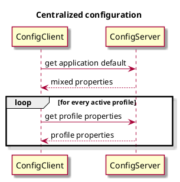
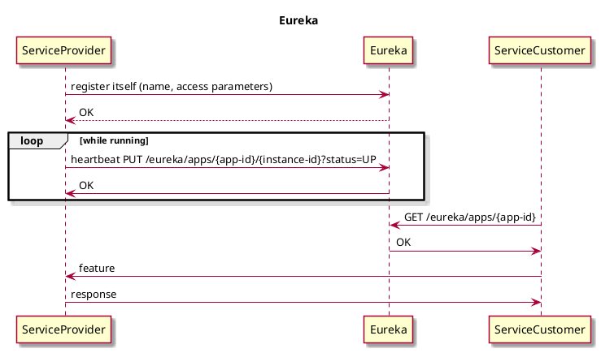

# Spring cloud

## Features
- Spring Cloud focuses on providing good out of box experience for typical use cases and extensibility mechanism to cover others. 
- Distributed/versioned configuration 
- Service registration and discovery 
- Routing 
- Service-to-service calls 
- Load balancing 
- Circuit Breakers 
- Distributed messaging 
- Short lived microservices (tasks)
- Consumer-driven and producer-driven contract testing

# Introduction

## Spring boot
Spring Boot makes it easy to create stand-alone, production-grade Spring based Applications that you can "just run".

Most Spring Boot applications need **minimal** Spring **configuration** (by user).

Spring boot guess the details based on
- available classes in classpath
- existing bean (created by developer)
- property value (application.properties)

## Spring cloud setup
- spring initializr
- intelliJ
- https://spring.io/projects/spring-cloud/

```xml
  <properties>
    <java.version>17</java.version>
    <spring-cloud.version>2023.0.0</spring-cloud.version>
  </properties>
  <dependencies>
    <dependency>
      <groupId>org.springframework.cloud</groupId>
      <artifactId>spring-cloud-starter-config</artifactId>
    </dependency>

    <dependency>
      <groupId>org.springframework.boot</groupId>
      <artifactId>spring-boot-starter-test</artifactId>
      <scope>test</scope>
    </dependency>
  </dependencies>

  <dependencyManagement>
    <dependencies>
      <dependency>
        <groupId>org.springframework.cloud</groupId>
        <artifactId>spring-cloud-dependencies</artifactId>
        <version>${spring-cloud.version}</version>
        <type>pom</type>
        <scope>import</scope>
      </dependency>
    </dependencies>
  </dependencyManagement>

```

## Service discovery

### Eureka
- Netflix
- Cluster

Eureka receives heartbeat messages from each instance belonging to a service.
If the heartbeat fails over a configurable timetable, the instance is normally removed from the registry.


### Server side
- **spring-cloud-starter-netflix-eureka-server**
- **@EnableEurekaServer**
- works in cluster
- default port **8761**

By default, every Eureka server is also a Eureka client and requires (at least one) service URL to locate a peer.

standalone mode
```yaml
server:
  port: 8761

eureka:
  instance:
    hostname: localhost
  client:
    registerWithEureka: false
    fetchRegistry: false
    serviceUrl:
      defaultZone: http://${eureka.instance.hostname}:${server.port}/eureka/
```

### Client side
- **spring-cloud-starter-netflix-eureka-client**
- **@EnableEurekaClient** (optional)
- client register itself (provides meta-data)
  - host, 
  - port, 
  - health indicator URL (/info and /health), 
  - home page, and other details
  - send heartbeat (hostname:app-id:port)
  - status: UP, DOWN, STARTING, OUT_OF_SERVICE and UNKNOWN

```yaml
eureka:
  client:
    serviceUrl:
      defaultZone: http://localhost:8761/eureka/
```

## Client Load Balancer

### Ribbon
- maintenance mode 
- outdated
- no support

### Spring Cloud LoadBalancer
- Spring Cloud Commons
- reactive support
- cached (spring.cloud.loadbalancer.cache.ttl)
- capacity (spring.cloud.loadbalancer.cache.capacity)
- ttl: 35, initialCapacity: 256.
- Weighted
- pluggable algorithm
  - endpoint selection
  - instance list suppliers
  - filters
- RestTemplate/WebClientBuilder/WebClient/RestClient
- dependency **spring-cloud-starter-loadbalancer**

Spring Cloud LoadBalancer creates a separate Spring child context for each service id. 
By default, these contexts are **initialised lazily**, whenever the first request for a service id is being load-balanced.

The ReactiveLoadBalancer implementation that is used by default is RoundRobinLoadBalancer.

use the **@LoadBalanced**
```java
@Configuration
@LoadBalancerClient(name = "say-hello", configuration = SayHelloConfiguration.class)
public class WebClientConfig {

  @LoadBalanced
  @Bean
  WebClient.Builder webClientBuilder() {
    return WebClient.builder();
  }
}
```

```java
private final WebClient.Builder loadBalancedWebClientBuilder;

public UserApplication(WebClient.Builder webClientBuilder) {
    this.loadBalancedWebClientBuilder = webClientBuilder;
  }

  @RequestMapping("/hi")
  public Mono<String> hi(@RequestParam(value = "name", defaultValue = "Mary") String name) {
    return loadBalancedWebClientBuilder.build().get().uri("http://say-hello/greeting")
        .retrieve().bodyToMono(String.class)
        .map(greeting -> String.format("%s, %s!", greeting, name));
  }
```

## Centralized configuration


### Spring config based
With the Config Server you have a central place to manage external **properties** for applications across all **environments**.

- _Environment_ and _PropertySource_ abstraction
- supports labelled versions of configuration environments
- HTTP, resource-based API for external configuration
- Encrypt and decrypt property values (symmetric or asymmetric)

#### Server side
- Retry support
- Pluggable
  - Git (default)
  - File System
  - Vault
  - Jdbc
  - S3
- **@EnableConfigServer**
- **spring-cloud-config-server**
- proposed port : **8888**
- /env endpoint
- /{name}/{profile}/{label}

##### setup
spring.config.name=configserver (start on 8888 automatically)

```java
@SpringBootApplication
@EnableConfigServer
public class ConfigServer {
  public static void main(String[] args) {
    SpringApplication.run(ConfigServer.class, args);
  }
}
```

The Environment resources are parametrized by three variables:
- {application}, which maps to **spring.application.name** on the client side.
- {profile}, which maps to **spring.profiles.active** on the client (comma-separated list, Environment.getActiveProfiles()).
- {label}, which is a server side feature labelling a "versioned" set of config files. f.e. "master"

Active profiles take precedence over defaults, and, if there are multiple profiles, the last one wins


#### Client side
- Bind to the Config Server and initialize Spring Environment with remote property sources
- server default endpoint: **http://localhost:8888**
- high availability solution
  - comma-separated list under the spring.cloud.config.uri property
  - all instances register in a Service Registry like Eureka

> Spring Boot 2.4

Spring Boot Config Data resolves configuration in a two step process. 
1. loads all configuration using the **default profile**. This allows Spring Boot to gather all configuration which may activate any additional profiles. 
2. After it has gathered **all activated profiles** it will load any additional configuration for the active profiles.

application.properties
```properties
spring.config.import=optional:configserver:
```
Removing the optional: prefix will cause the Config Client to fail if it is unable to connect to Config Server.

##### reload configuration

- Health Indicator attempts to load. 
- The response is cached for performance reasons (for 5 minutes).
- Health indicator is disabled for security reason

Because of default label is main we have to override.

```properties
management.endpoints.web.exposure.include=refresh
spring.cloud.config.server.git.default-label=master
```

```shell
POST http://127.0.0.1:8082/actuator/refresh
```


### Spring Cloud Consul Config
- key-value storage
- value/file per key
- auto refreshed

## Spring Cloud Sleuth

Distributed 
- tracing
- logging
- debugging

## Spring Cloud Gateway

This project provides a libraries for building an API Gateway on top of Spring WebFlux or Spring WebMVC. 
Spring Cloud Gateway aims to provide a simple, yet effective way to route to APIs and provide cross cutting concerns to them such as: security, monitoring/metrics, and resiliency.

### Features
- Built on Spring Framework and Spring Boot 
- Able to match routes on any request attribute. 
- Predicates and filters are specific to routes. 
- Circuit Breaker integration. 
- Spring Cloud DiscoveryClient integration 
- Easy to write Predicates and Filters 
- Request Rate Limiting 
- Path Rewriting
- Server side load balancing
- Middle layer among
  - clients
  - service implementation
- Sleuth support
- API gateway
- Service discovery
- Retry support
- filter chains
- dependency **spring-cloud-starter-gateway**

**Route**: The basic building block of the gateway. It is defined by an 
- ID, 
- a destination URI, 
- a collection of predicates, and 
- a collection of filters. 

A route is matched if the aggregate predicate is true.

**Predicate**: This is a Java 8 **Function Predicate**. The input type is a Spring Framework ServerWebExchange. 
This lets you match on anything from the HTTP request, such as headers or parameters.

f.e. **`r -> r.path("/get")`**

**Filter**: These are instances of **GatewayFilter** that have been constructed with a specific factory. 

Here, you can modify 
- requests 
- responses.

It can be applied 
- before 
- after 

sending the downstream request.

Example java based config
```java
@SpringBootApplication
public class DemogatewayApplication {
	@Bean
	public RouteLocator customRouteLocator(RouteLocatorBuilder builder) {
		return builder.routes()
			.route("path_route", r -> r.path("/get")
				.uri("http://httpbin.org"))
			.route("host_route", r -> r.host("*.myhost.org")
				.uri("http://httpbin.org"))
			.route("rewrite_route", r -> r.host("*.rewrite.org")
				.filters(f -> f.rewritePath("/foo/(?<segment>.*)", "/${segment}"))
				.uri("http://httpbin.org"))
			.route("hystrix_route", r -> r.host("*.hystrix.org")
				.filters(f -> f.hystrix(c -> c.setName("slowcmd")))
				.uri("http://httpbin.org"))
			.route("hystrix_fallback_route", r -> r.host("*.hystrixfallback.org")
				.filters(f -> f.hystrix(c -> c.setName("slowcmd").setFallbackUri("forward:/hystrixfallback")))
				.uri("http://httpbin.org"))
			.route("limit_route", r -> r
				.host("*.limited.org").and().path("/anything/**")
				.filters(f -> f.requestRateLimiter(c -> c.setRateLimiter(redisRateLimiter())))
				.uri("http://httpbin.org"))
			.build();
	}
}
```

property based config example
```properties
spring:
  cloud:
    gateway:
      routes:
      - id: after_route
        uri: https://example.org
        predicates:
        - Cookie=mycookie,mycookievalue
```

```properties
spring:
  cloud:
    gateway:
      routes:
      - id: after_route
        uri: https://example.org
        predicates:
        - After=2017-01-20T17:42:47.789-07:00[America/Denver]
```

```properties
spring:
  cloud:
    gateway:
      routes:
      - id: before_route
        uri: https://example.org
        predicates:
        - Before=2017-01-20T17:42:47.789-07:00[America/Denver]
```

cors example
```properties
spring:
  cloud:
    gateway:
      globalcors:
        cors-configurations:
          '[/**]':
            allowedOrigins: "https://docs.spring.io"
            allowedMethods:
            - GET
```

full property list

https://docs.spring.io/spring-cloud-gateway/reference/appendix.html

## Spring Vault

Vault is a tool for **securely accessing secrets**. 
A secret is anything that to which you want to tightly control access, 
- API keys, 
- passwords, 
- certificates, 
- other sensitive information. 

Vault provides a **unified interface to any secret** while providing tight access control and **recording a detailed audit log**.

key-value pair like normal property

### server
Downloadable binary from https://releases.hashicorp.com/vault/

### client

The config comes from vault (a la cloud config)
- dependency: **spring-cloud-starter-vault-config**
- or database dependency **spring-cloud-vault-config-databases**

```properties
spring.cloud.vault:
    host: localhost
    port: 8200
    scheme: https
    uri: https://localhost:8200
    connection-timeout: 5000
    read-timeout: 15000
    config:
spring.config.import: vault://
```
a la:
_spring.config.import: configserver_


## Spring Consul

Consul is a tool that provides components for resolving some of the most common challenges in a micro-services architecture:

Service Discovery – to automatically register and unregister the network locations of service instances
Health Checking – to detect when a service instance is up and running
Distributed Configuration – to ensure all service instances use the same configuration.

HashiCorp Consul is a service networking solution that enables teams **to manage secure network connectivity between services** 
and **across on-prem and multi-cloud environments and runtimes**. 
Consul offers service discovery, service mesh, traffic management, and automated updates to network infrastructure device. You can use these features individually or together in a single Consul deployment.


Consul provides a control plane that enables you to register, query, and secure services deployed across your network. 

download binaries
https://developer.hashicorp.com/consul/install?product_intent=consul

```shell
consul agent -dev
```

http://localhost:8500/

```shell
vault server -dev
```

# Appendix



